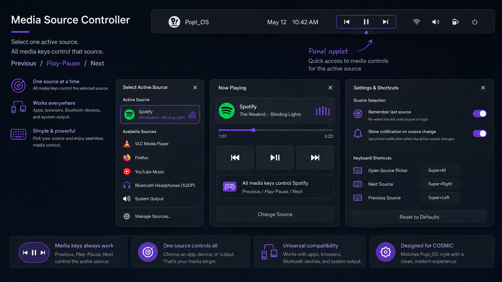

# COSMIC Media Source Controller

A Pop!_OS / COSMIC applet concept for choosing exactly which media source your keyboard media keys control.

The idea is simple: choose one active source, then **Previous**, **Play/Pause**, **Next**, **Stop**, **Volume**, and **Mute** always control that selected source.



## Why this exists

On Linux desktops, media keys sometimes control the wrong player when multiple apps are open. For example, Spotify may be playing, but the keyboard Play/Pause key may affect Firefox, VLC, a paused player, or another MPRIS client.

This project is designed to make that behavior explicit and predictable:

- choose one active source
- route media commands to that source
- switch sources from the COSMIC panel
- keep the panel icon compact with Previous / Play-Pause / Next controls
- use notifications when the active target changes

## Current status

This repository currently contains the first backend prototype and the UI design direction.

The backend uses `playerctl` to target MPRIS players by name. The next step is the native COSMIC panel applet UI.

## Planned applet behavior

### Panel icon

The panel applet should show compact media controls directly in the panel:

```text
| Previous | Play/Pause | Next |
```

The active source indicator appears under the panel control group.

### Source picker

Clicking the applet opens a source picker:

- Active Source
- Available Sources
- Apps: Spotify, VLC, Firefox, YouTube Music, etc.
- Devices: Bluetooth headphones and system output
- Manage Sources

### Now Playing panel

The Now Playing view shows:

- active source
- track title and artist
- progress bar
- Previous / Play-Pause / Next controls
- Change Source button

### Settings

Settings should stay minimal:

- Remember last source
- Show notification on source change
- Open Source Picker shortcut
- Next Source shortcut
- Previous Source shortcut

There is no switch for whether media keys are captured. The entire app exists to make media keys control the selected source.

## Installation from source

```bash
sudo apt update
sudo apt install -y playerctl libnotify-bin cargo

git clone https://github.com/Tihulu/cosmic-media-source-controller.git
cd cosmic-media-source-controller
cargo build --release
sudo install -Dm755 target/release/cosmic-media-source-controller /usr/local/bin/cosmic-media-source-controller
```

## Quick local usage

List available media sources:

```bash
cosmic-media-source-controller list
```

Select Spotify:

```bash
cosmic-media-source-controller set spotify
```

Control the selected source:

```bash
cosmic-media-source-controller play-pause
cosmic-media-source-controller next
cosmic-media-source-controller previous
cosmic-media-source-controller stop
```

Cycle to the next source:

```bash
cosmic-media-source-controller cycle
```

## Recommended keyboard shortcuts

Until the native COSMIC applet is implemented, bind these commands in desktop keyboard shortcuts:

| Action | Command |
| --- | --- |
| Play / Pause | `cosmic-media-source-controller play-pause` |
| Next Track | `cosmic-media-source-controller next` |
| Previous Track | `cosmic-media-source-controller previous` |
| Stop | `cosmic-media-source-controller stop` |
| Next Source | `cosmic-media-source-controller cycle` |

## Architecture

The project should evolve in three layers:

1. **Backend router**  
   Stores the active source and forwards media commands to it.

2. **MPRIS source model**  
   Detects player name, playback status, metadata, track position, and icon.

3. **COSMIC panel applet**  
   Shows the compact panel controls, source picker, Now Playing view, and settings.

For the long-term version, the best approach is an MPRIS proxy/router: the desktop sends media key events to the controller, and the controller forwards those events to the selected player.

## Development

```bash
cargo fmt
cargo clippy --all-targets --all-features -- -D warnings
cargo test
```

## License

GPL-3.0-or-later
